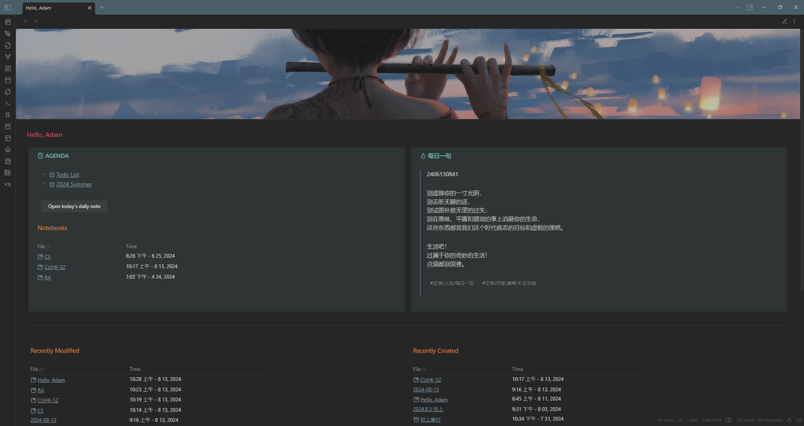

# Obsidian-Homepage
My customized Obsidian homepage. You may find my blog [How to DIY Obsidian homeopage](https://ghost04718.github.io/skills/obsidian/2024/08/14/Obsidian-homepage.html) helpful.

## Screenshots

## Key Features
- **Countdown**
  - Display and update the countdown automatically
- **Obsidian Heat Map**
  - Similar to GitHub heat map, it displays how many files you create everyday (you can adjust it according to your need)
- **Daily Sentence**
  - Randomly select one note (in a particular way) and display its content (my implementation is one sentence per note with some tags)
- **Daily Note Button**
  - Open or create Today's Daily Note via a button
  - Automatically roll over unchecked checkboxes from your last Daily Note
- **Habit Tracker**
  - Track your habits and display in the calender

## Prerequisite
### Plugins
- Banners
- Buttons
- Contribution Graph
- Dataview
- Homepage
- Iconize
- Minimal Theme Settings
- Rollover Daily Todos
- Style Settings
- Tracker
### CSS snippets
You can download from `snippets` and drag them into your `vault/.obsidian/snippets` (if the folder does not exist you can create one yourself).
