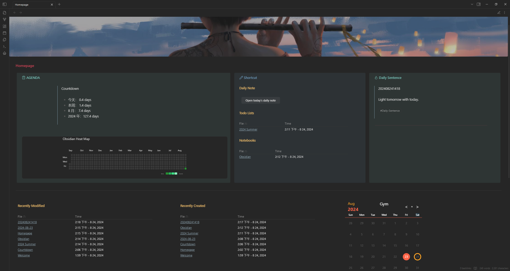

# Obsidian-Homepage
My customized Obsidian homepage. You may find my blog [How to DIY Obsidian homeopage](https://ghost04718.github.io/skills/obsidian/2024/08/14/Obsidian-homepage.html) helpful.

## Screenshots

## Key Features
- **Daily Sentence**
  - Randomly select one note (in a particular way) and display its content (my implementation is one sentence per note with some tags)
> [!Note]
> You need to mannually store the sentences locally in your vault.
- **Daily Note Button**
  - Open or create Today's Daily Note via a button
  - Automatically roll over unchecked checkboxes from your last Daily Note
> [!Note]
> Your Language need to be **English**. Otherwise the command will fail (you can fix this by changeing the button code).
- **Shortcuts**
  - List the links of all notes whose **alias** contains "notebook"

## Prerequisite
### Plugins
- Banners
- Buttons
- Dataview
- Homepage
- Iconize
- Minimal Theme Settings
- Rollover Daily Todos
- Style Settings
### CSS snippets
You can download from `snippets` and drag them into your `vault/.obsidian/snippets` (if the folder does not exist you can create one yourself) .

---
## 实况

## 关键功能
- **每日一句**
  - 随机选择一条笔记（以特定方式）并显示其内容（我实现的是每条笔记包含一句话和一些标签）
> [!Note]
> 你需要手动将句子存储在你的仓库中。

- **日记按钮**
  - 通过一个按钮打开或创建今天的日记
  - 自动转移上次日记中未勾选的复选框
> [!Note]
> 你的语言需要设置为**English**，否则命令将失败（你可以通过更写按钮代码来修复此问题）。

- **快捷键**
  - 列出所有**别名**包含“notebook”的笔记链接

## 前置条件
### 插件
- Banners
- Buttons
- Dataview
- Homepage
- Iconize
- Minimal Theme Settings
- Rollover Daily Todos
- Style Settings
### CSS 代码片段
你可以从 `snippets` 下载，并将它们拖入你的 `vault/.obsidian/snippets` 文件夹中（如果该文件夹不存在，你可以自行创建）。
